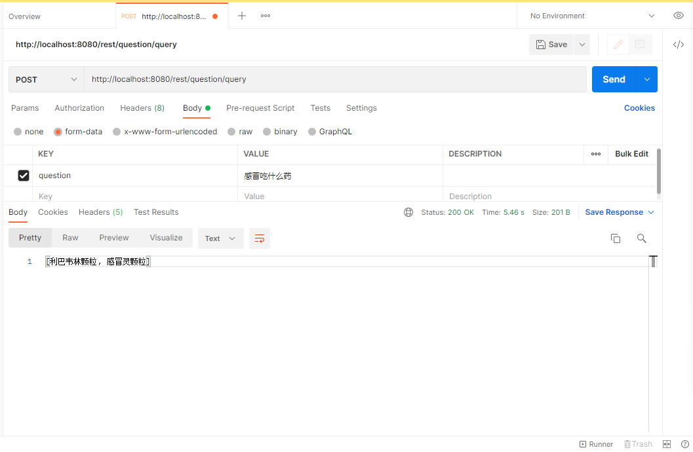

#### 医疗知识图谱自动问答系统
## 生成词典
运行 test/java/com/GenerateData.java
## 训练模型 (问题类型分类)
运行 test/java/com/AppGenerateDataDemo.java 当中的trainTextCnn 方法
## 数据插入neo4j （时间比较长，可以去睡一觉了）
运行 test/java/com/AppGenerateDataDemo.java insertNeo4j 方法
## 启动 spring boot
运行 src/main/java/com/App.java main 方法
## 运行的效果

